JOSE VICENTE TEJERO - 12/01/2021

RESUMEN

**Lesson 2: Web Deployment on Linux**

**Demonstration: Deploying an ASP.NET Core Web Service with Nginx**

 

 

 

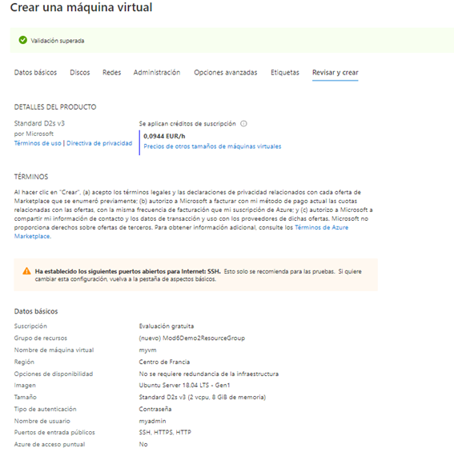

 

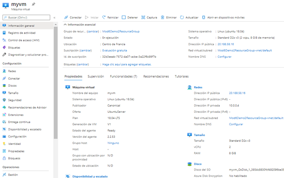

 

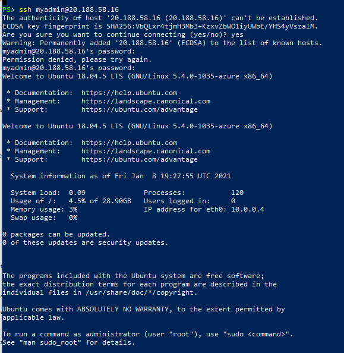

 

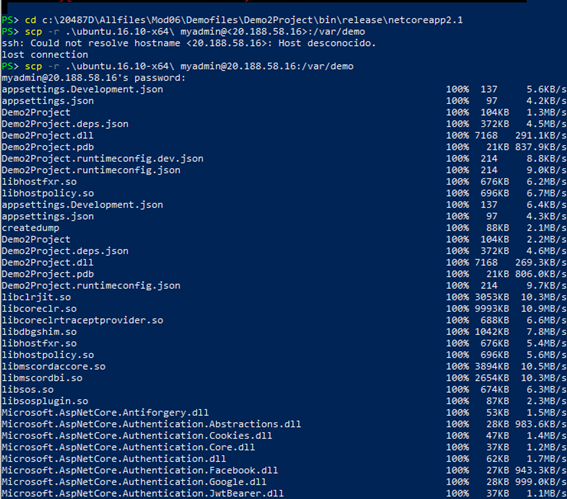

 

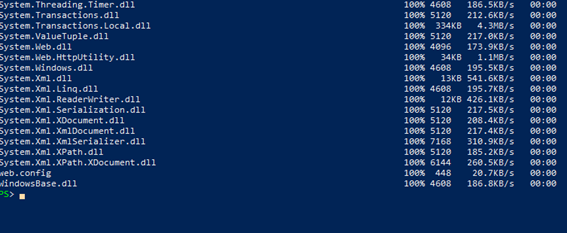

 

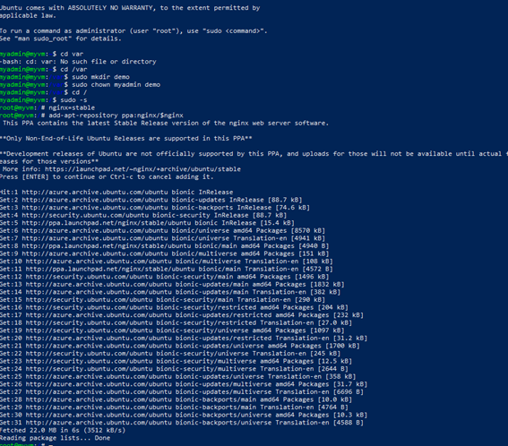

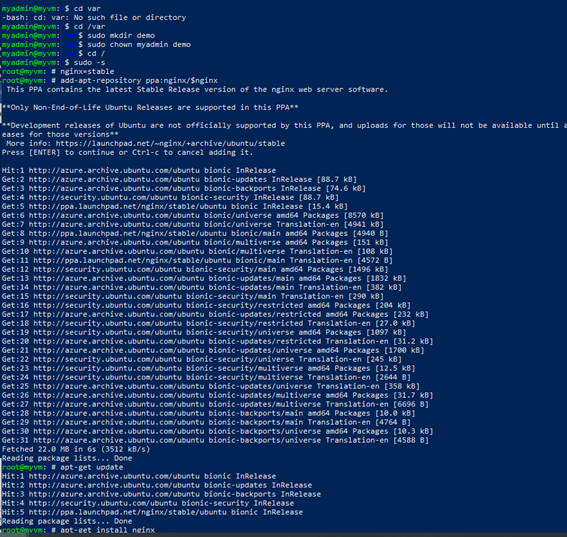

 

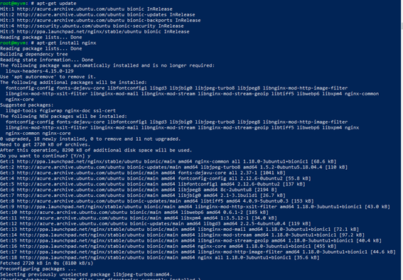

 

 

 

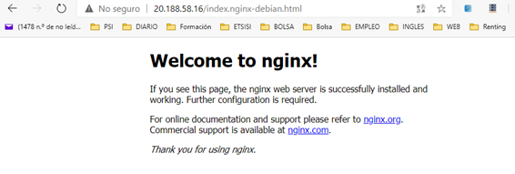

 

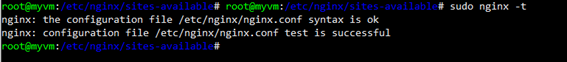

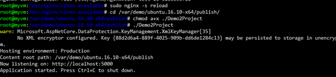

 

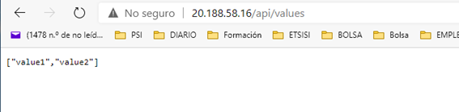

 

\# Lesson 3: Continuous Delivery with Microsoft Visual Studio Team Services

\### Demonstration: Continuous Delivery to Websites with Git and Visual Studio Team Services

 

 

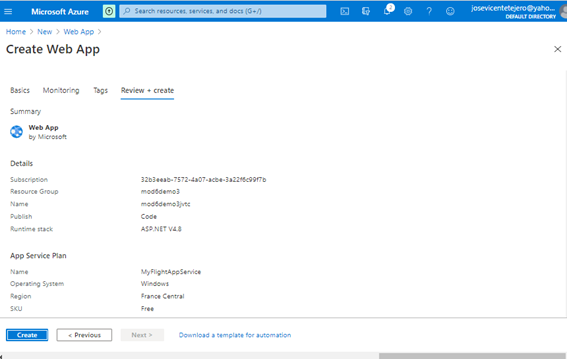

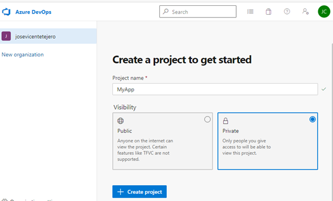

 

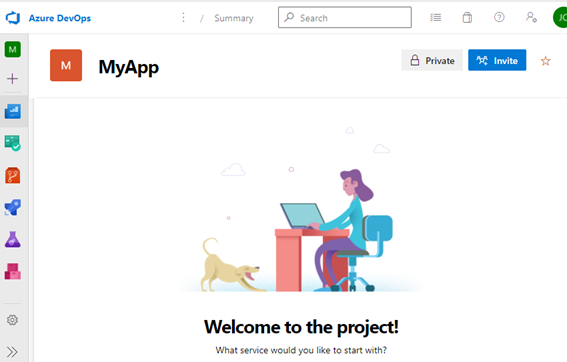

 

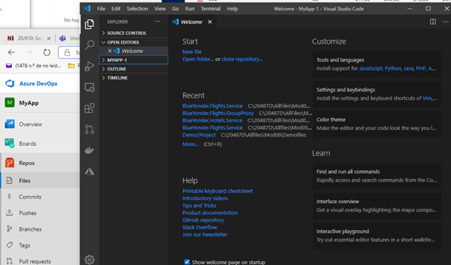

 

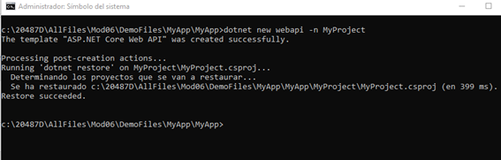

 

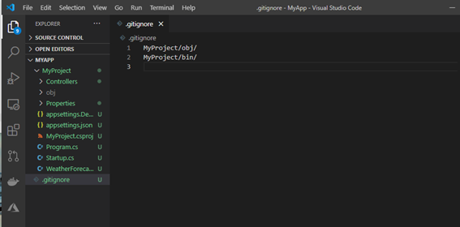

 

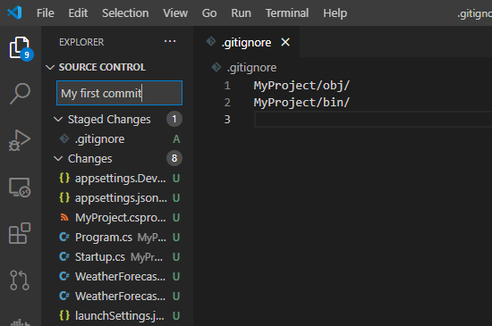

 

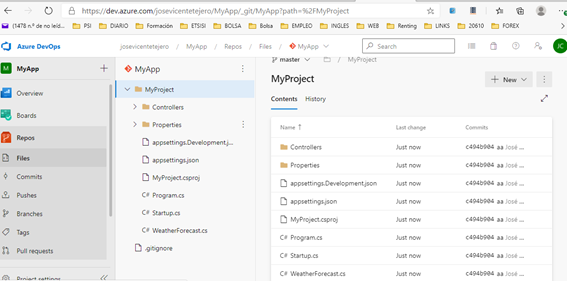

 

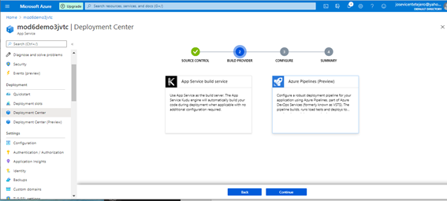

 

 

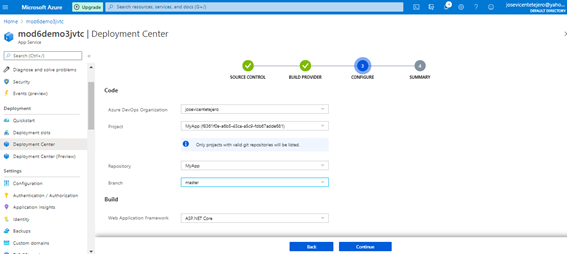

 

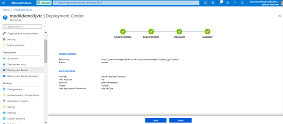

 

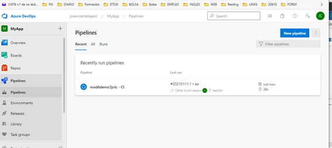

 

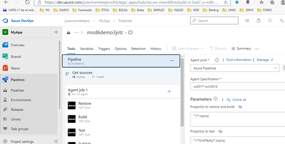

 

Deployment center    

 

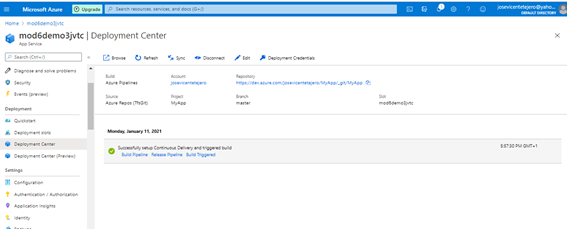

El resultado es:

 

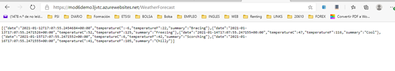

 

Hacemos otro cambio y lo subimos:

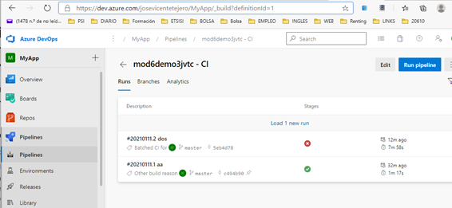

 

El resultado:

 

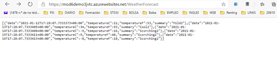

\# Lesson 4: Deploying to Staging and Production Environments

\### Demonstration: Using Deployment Slots with Web Apps

 

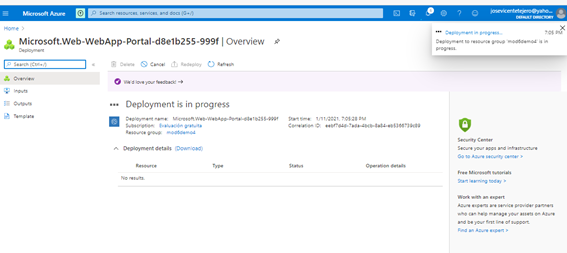

 

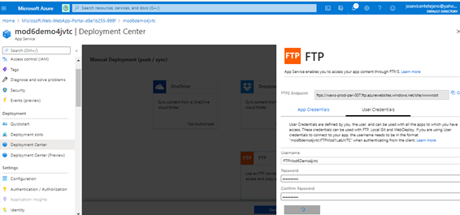

 

 

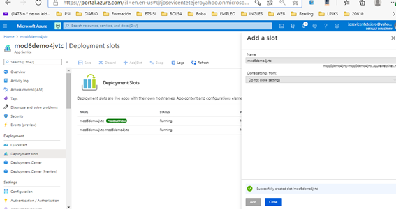

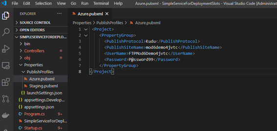

 

 

 

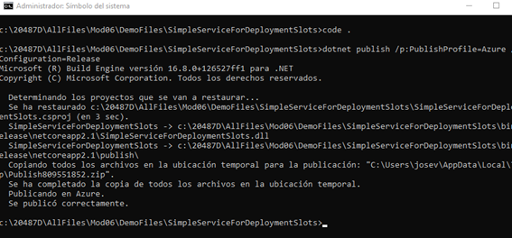

 

El resultado:

 

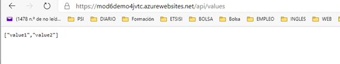

 

 

 

 

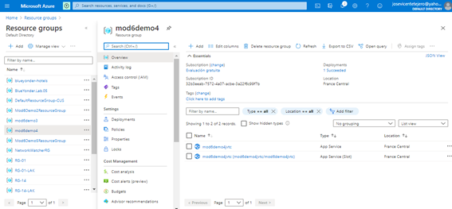

 

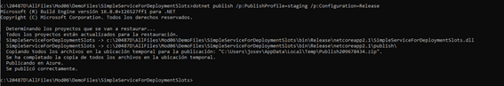

 

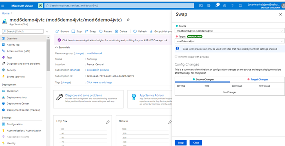

 

 

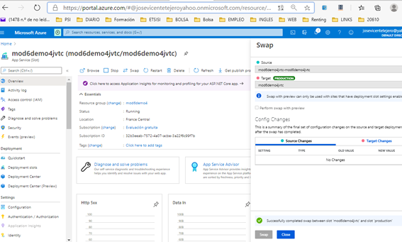

 

Vemos los cambios realizados:

 

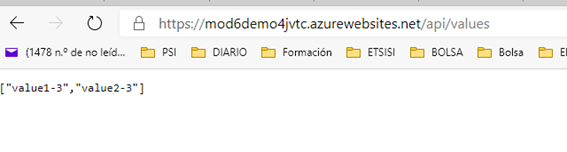

 

 

 

 

 

 

 

 

\# Lesson 5: Defining Service Interfaces with Azure API Management 

\### Demonstration: Importing and Testing an OpenAPI Specification

 

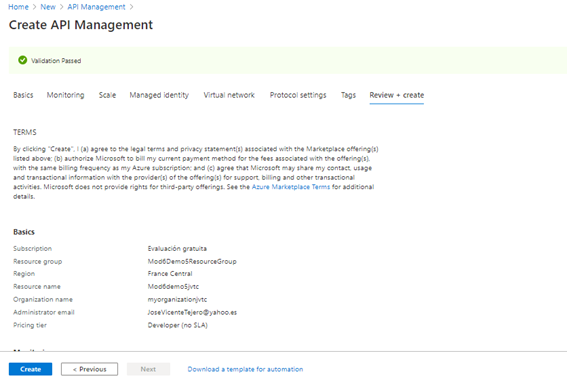

 

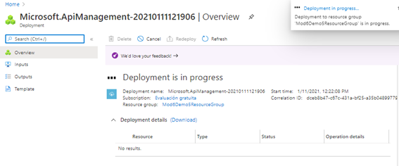

 

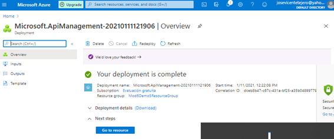

 

 

 

 

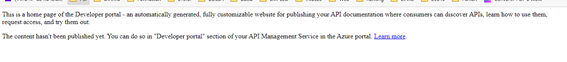

 

 

 

 

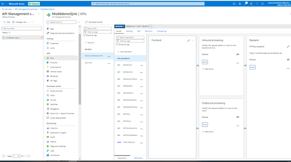

 

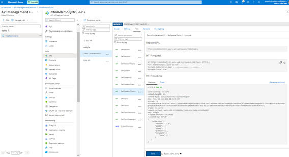

 

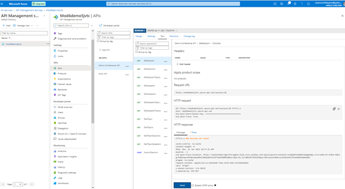

 

 

 

 

 

Lesson 5: Defining Service Interfaces with Azure API Management

Demonstration: Limiting Call Rates Using API Management

 

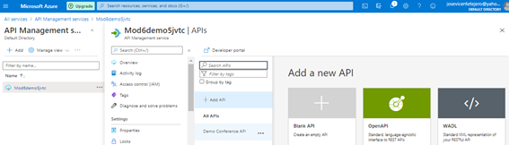

 

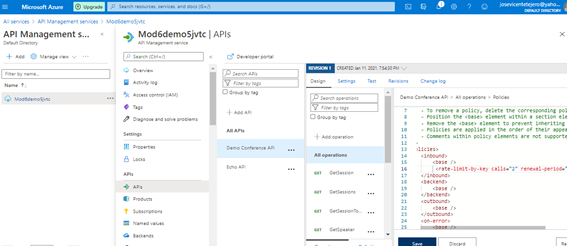

 

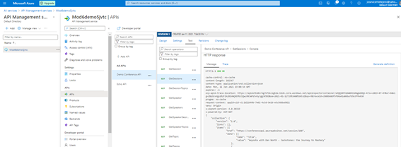

 

 

 

 

 

 

 

 
PROBLEMAS
No